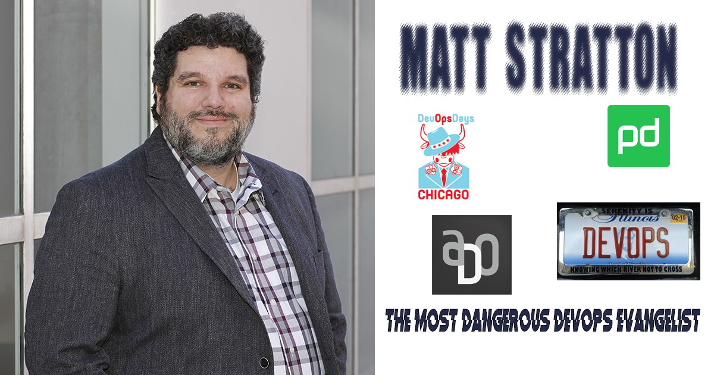
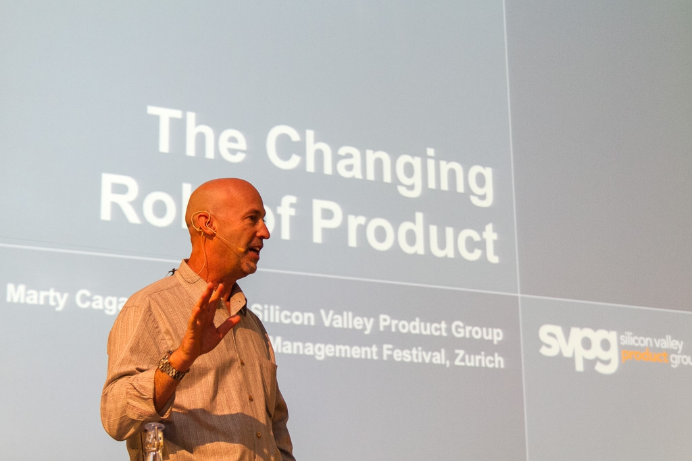
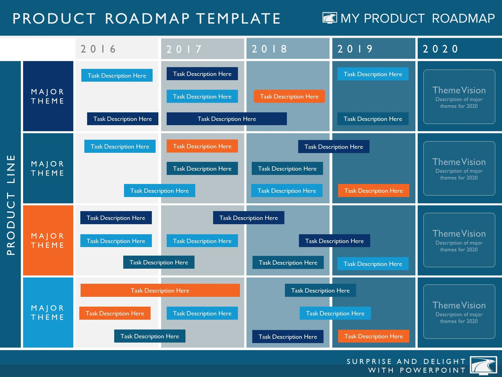
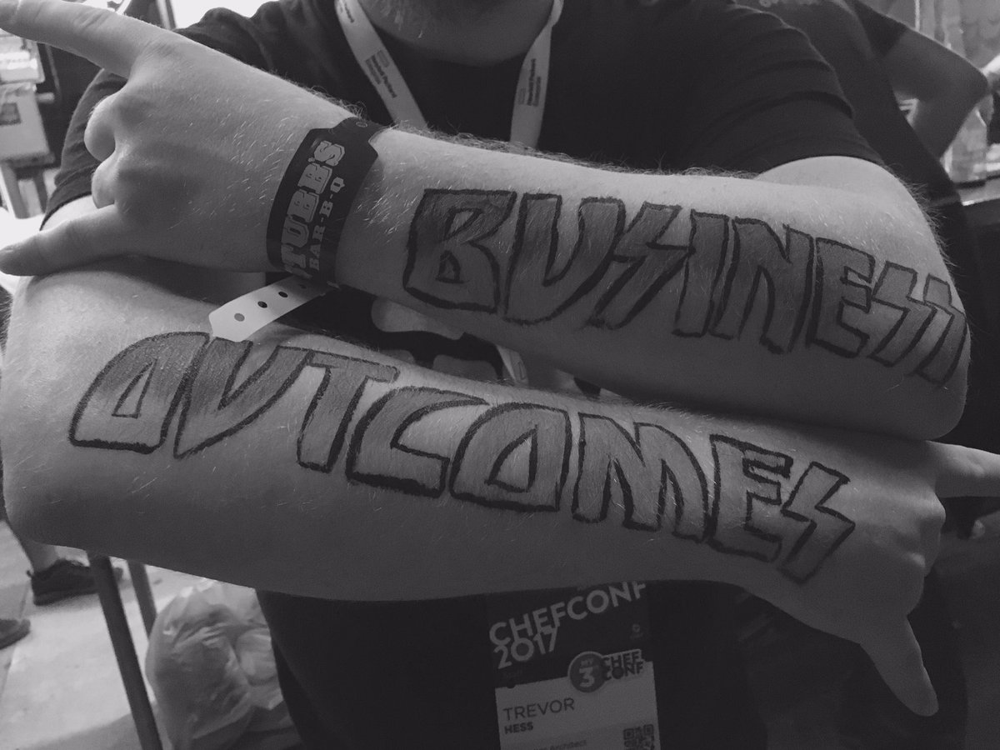
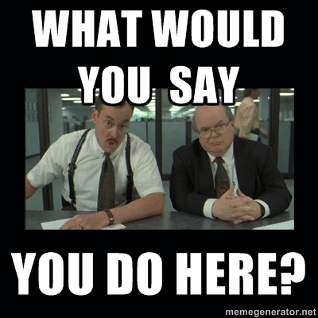
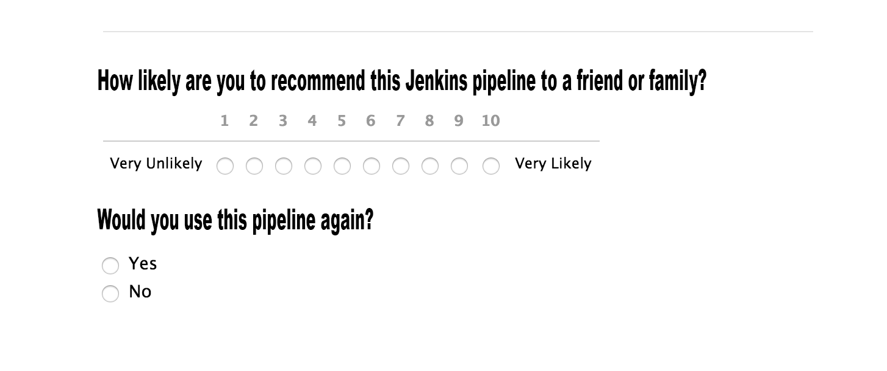
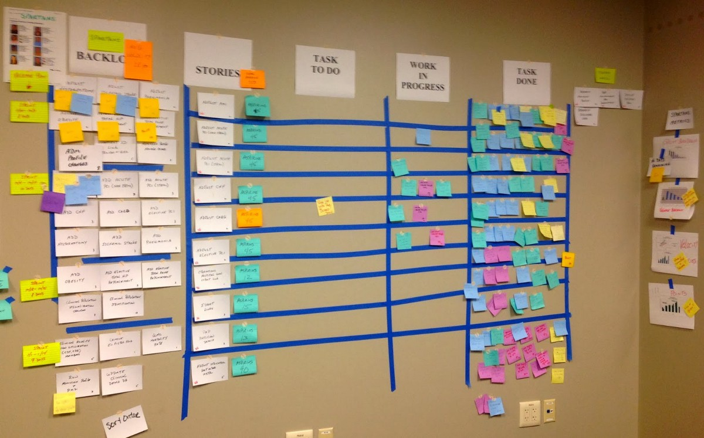

footer: @mattstratton
theme: Simple,2
build-lists: true

[.hide-footer]
# [fit] EVERYTHING'S A PRODUCT

## How To Apply Product Management Practices to Technology Services
---
[.hide-footer]

^ Who am I? My name is Matt Stratton. I'm a devops evangelist at PagerDuty. I'm an organizer of DevOpsDays Chicago, one of the global devopsdays organizers, and the creator and co-host of Arrested DevOps.

^ Oh yeah. And my license plate says "devops"

---

## [fit] let me tell you a story...

^ before digging into the nitty gritty, let me tell you a little bit around how I got here

___
[.footer: By Daniel Schwen - Own work, CC BY-SA 4.0, https://commons.wikimedia.org/w/index.php?curid=7429653]

^ I'm from Chicago.

---

[.hide-footer]

^ We have built some amazing things

---
[.hide-footer]

^ Some of those things seem weird to places outside

---

^ but the problem is, we tend to become rigid and dogmatic about them.

—--

^ I worked in a lot of traditional IT shops. There is a lot of insurance, finance, things of that nature in Chicago. It's what we do. Salt of the earth. You know how it goes.

---

^ Then I got to meet Marty Cagan. I was working for Apartments.com at the time, and they had brought Marty in to speak to the developers. I'm not quite sure how I got invited to the two-day session...but it was very eye-opening. 

---

# your it services can be products

^ we tend to think about our services as processes, or ways of doing work. Well, everything is a "way of doing work"...everything is work. 

^ think about lyft - we would say lyft is a PRODUCT. But it's not CPG (consumer packaged goods) - it's a customer experience. Yes, there is software that plays a key role. And tools. And humans.

---

# you have customers, right?

---

## [fit] if you don't know who your customers are, go figure it out

---

##### we'll wait

---

> *"My role is geared toward internal development rather than developing a product that we ship externally out to our customers. I set the direction of where we’re going as a team and what initiatives we’re going to take on to improve the lives of PagerDuty’s developers."*

-- Marguerite des Trois Maisons, SRE Product Owner, PagerDuty

---

## some examples of things you can productize:

- service requests
- software delivery process
- infrastructure as code

^ I'm not sure i spelled productize properly. I am also not sure it is a real word.

---

^ I need to explain something. Blah blah blah Emily's mom at Charlotte

---

^ Here's the tweet that gives a little context.

---

# humor me, please

^ Do me a favor. For the rest of my talk, even though I'm sure you can think of 100 reasons why this would never work at your company or organization...humor me. Let's pretend it will. Just for, what, another half hour? you can do that. 

---
# emily's mom is watching to make sure you do

^ She's probably not really watching. I don't think this is live-streamed. But on twitter yesterday I threatened to include her in this talk, and if we start lying on Twitter, what good will that platform be?

---

# at least half of our ideas are going to fail

---
[.hide-footer]

---
[.hide-footer]

---
[.hide-footer]

---

# this is why roadmaps are bad

# and if you have one you should feel bad

---

# output vs outcome

^ We are used to work in projects in IT. We are going to have the "Service Desk Revamp" project. Or something like that.

^ The problem is, projects are output based. "Look, I made a thing! Look at how many things we made!" But what matters are business outcomes.

---
# discovery

- it's always happening
- it's not just for your boss or for fancy-pants architects
- it's not saying "yo, what are your requirements?"

^ discovery is HARD. Our customers don't know what's possible. 

---

# establish compelling value

^ This is tough. But without it, you are screwed. If there isn't a compelling value to your customer (be it software engineers on other teams, your help desk, etc) nobody will use your product, even if they are told to do so. And your product will fail in your internal marketplace. 

---

# user experience over engineering

^ this one is hard. Think about what it will be like for the people using your solution - a lot of them will spend hours and hours of every week with this, perhaps. Can you make it more delightful? 

---

> The most important thing is to know what you can't know
-- Mark Andreessen

^ Again, remember that most of your ideas won't work out. 

---

# test feasblity during discovery

^ try to build/implement as little as possible. For processes, often times role-play workshops with your customers - experiment. Walk through the stuff on paper. 

---

# minimum viable prototype

^ You might have heard of MVP's. You probably use them all the time. But they are unfortunately named. They should be called "minimum viable prototype" - an MVP is never something that should be considered anywhere close to production ready. It's just sometime to try out to get a feel, etc.

---

# bad example of mvp

- We are going to create an MVP of our Chef implementation. 
- We'll do this by installing the chef client on 10,000 nodes
- Then we will write an MVP cookbook that simply checks to see if a file is there we are used to seeing

^ See the problem? It will take us a LONG time to get to a point to even see if we learned anything (the installation of chef on the 10,000 nodes isn't going to be instant)

^ Let's always think of our mvp's as the smallest prototype required to answer the question we need to know now

---

# know your business

^ as always, anything you are doing needs to service what the business is there for. How does this product help a business outcome? 

^ you will need to convinvce your stakeholder's that you understand what their constraints are - and that you won't screw them over

___

# know your customer

- why do they do what they do?
- and what exactly *do* they do?

--- 

# keep gathering feedback

---
# always be doing discovery 

^ In any given sprint, you should have just as many discovery-related stories, work, whatever you want to call them as delivery ones. 

---

# avoid analysis paralysis

^ Every time you find yourself saying "what if THIS happened? Or what if we hit THIS corner case, I want you to imagine Samuel L. Jackson telling you he doesn't want to hear about any... if's.

---

# you're never going to be done
---

## and that's okay
---

### emily's mom will still love you
---

#### she is rooting for you
---

##### and so am i

---
[.hide-footer]

---
[.build-lists: false]
[.hide-footer]

- twitter.com/mattstratton
- github.com/mattstratton
- arresteddevops.com
- mattstratton.com/speaking
- pagerduty.com/blog/employee-spotlight-sre-product-owner

